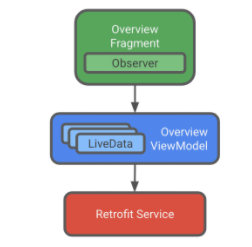
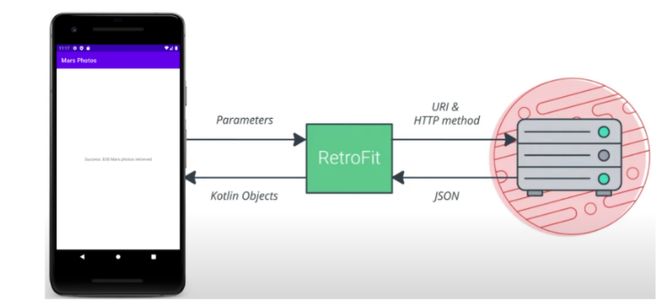

# Mars Photos App
An app that connects to a web service to retrieve and display the Mars photos.

# Screenshots
   

   

# Learnings

* **Thread**
  - A thread is the smallest unit of code that can be scheduled and run in the confines of a program. 
  - A thread is an abstraction that you can use when writing code to determine which path of execution each instruction should go.
  - ```
    fun main() {
    val thread = Thread {
      println("${Thread.currentThread()} has run.")
     }
     thread.start()
    }
   ```
  - ```
     // Output: Thread[Thread-0,5,main] has run. 
    ``` 
  - currentThread() returns a Thread instance which is converted to its string representation which returns the **thread's name, priority, and thread group.**

* **Concurrency** 
  - Working with threads other than the main thread, allows your app to perform complex tasks, such as downloading images, in the background while the app's user interface remains responsive. This is called concurrent code, or simply, concurrency.
  - Concurrency allows multiple units of code to execute out of order or seemingly in parallel permitting more efficient use of resources.
  - Biggest advantage of concurrency is it makes your code **non-blocking** meaning performing a long running task won't stop the execution of other things.

* In order to achieve concurrency, there are two possibilities:
    - using Threads
    - using Coroutines

* **Concurrency using Threads**
  - ```
    fun main() {
     val states = arrayOf("Starting", "Doing Task 1", "Doing Task 2", "Ending")
     repeat(3) {
         Thread {
             println("${Thread.currentThread()} has started")
             for (i in states) {
                 println("${Thread.currentThread()} - $i")
                 Thread.sleep(50)
             }
         }.start()
      }
     }
    ```

* **Concurrency with Coroutines**
  - ```
    import kotlinx.coroutines.*

    fun main() {
      val states = arrayOf("Starting", "Doing Task 1", "Doing Task 2", "Ending")
      repeat(3) {
       GlobalScope.launch {
        println("${Thread.currentThread()} has started")
        for (i in states) {
         println("${Thread.currentThread()} - $i")
         delay(5000)
        }// for ended
      } // launch ended
     } // repeat ended
    } // main ended
    
    ```     
    
* **Challenges with Threads**:
    - *Threads require a lot of resources* - Creating, switching, and managing threads takes up system resources and time limiting the number of threads that can be managed simultaneously. The costs of creation can really add up.
    - *Unpredictable behaviour* - Thread is an abstraction for how a processor appears to handle multiple tasks at once. As the processor switches between sets of instructions on different threads, the exact time a thread is executed and when a thread is paused is beyond your control. We cannot always expect predictable output when working with threads directly.
    - *Race condition* - can occur when multiple threads try to access the same value in memory at the same time.

* Kotlin assumes that everything runs on the main thread (i.e UI thread) unless explicitly stated. This means each instruction waits for the previous one to finish before the next line executes.
  
* **Coroutines**
  - A framework to manage concurrency in a more performant and simple way with its lightweight thread which is written on top of the actual threading framework to get the most out of it by taking the advantage of cooperative nature of functions.  
  - Coroutine is a light-weight thread. Like threads, coroutines can run in parallel, wait for each other and communicate. 
  - The biggest difference is that coroutines are very cheap, almost free: we can create thousands of them, and pay very little in terms of performance. 
  - Coroutines enable multitasking, but provide another level of abstraction over simply working with threads. 
  - One key feature of coroutines is the ability to store state, so that they can be halted and resumed.
  - The state, represented by continuations, allows portions of code to signal when they need to hand over control or wait for another coroutine to complete its work before resuming. This flow is called cooperative multitasking.
  
* **Components of a Coroutine**
  - **CoroutineScope** - A context that enforces cancellation and other rules to its children and their children recursively. Functions used to create new coroutines such as launch() and async() extend CoroutineScope.
  - **Dispatcher** - **Job** - A cancelable unit of work, such as one created with the launch() function. with a lifecycle, inside a CoroutineScope. It manages which backing thread the coroutine will use for its execution, removing the responsibility of when and where to use a new thread from the developer.
  - **Job** - A cancelable unit of work, such as one created with the launch() function with a lifecycle, inside a CoroutineScope.

* **suspend** - A suspend function can only be called from a coroutine or another suspend function.

* **launch() vs async() vs withContext() vs runBlocking()**
  - launch() - fires and forget. Doesn't return a result.
  - async() - performs a task and returns a result. Use await() to access the returned value. Does parallel code execution. use async() when you want to return results from multiple tasks.
  - withContext() - performs a task and returns a result. Does serial code execution. use withContext() when you want to return results from single task.
  - runBlocking() - Never use in production code. Can be used for JUnit testing.
  
* **Deferred** - Deferred is a placeholder for a future return value. async()  functions returns a value of type Deferred.

* **CoroutineScope vs SupervisorScope**
  - CoroutineScope - will cancel the other async functions whenever any of its children fails.
  - SupervisorScope - will continue with the execution of other tasks even when some of the task fails.

* **Important Differences**
  - Threads are managed by OS while coroutines are managed by users.
  - Coroutines do not replace threads, it’s more like a framework to manage it.
  - Threads are costly whereas coroutines are cheap.
  
* **Web service** - Software-based functionality offered over the internet that enables your app to make requests and get data back.

* **RESTful services** - Common web services use a REST architecture. Web services that offer REST architecture are known as RESTful services. RESTful web services are built using standard web components and protocols.

* **Retrofit** - Retrofit library is a client library that enables your app to make requests to a REST web service. 
  - 
  - 

* **Converters** - Use converters to tell Retrofit what to do with data it sends to the web service and gets back from the web service.

* **Moshi** - Moshi library is an Android JSON parser that converts a JSON string into Kotlin objects. Retrofit has a converter that works with Moshi. Moshi matches the keys in a JSON response with properties in a data object that have the same name.

* **Coil** 
  - Coil library is used to download, buffer, decode, and cache your images. 
  - Coil basically needs two things:
    - The URL of the image you want to load and display.
    -  An ImageView object to actually display that image.
    - [Eg. ImageView.load(imageUrl)]
  
* **Binding Adapters**
  - Binding Adapters are annotated methods used to create custom setters for custom properties of your view. [eg. custom imageUrl property for ImageView]
  - Binding adapters are extension methods that sit between a view and that view's bound data.
  - To update the list of properties when it changes, use a binding adapter between the RecyclerView and the layout.
  - Binding adapters are extension methods annotated with the @BindingAdapter annotation.
  - Below annotation, define a function that takes in first parameter as the type of the target View and the second is the value being set to the attribute.

* **ListAdapter**
  - ListAdapter is a subclass of the RecyclerView.Adapter class for presenting List data in a RecyclerView, including computing diffs between Lists on a background thread. 
  - The advantage of using *DiffUtil* is every time some item in the RecyclerView is added, removed or changed, the whole list doesn't get refreshed. Only the items that have been changed are refreshed.

* Call *executePendingBindings()* after setting the property, which causes the update to execute immediately.

* Call *adapter.submitList(marsPhotosList)* to update the RecyclerView when a new list is available

* An **enum** is a data type that can hold a set of constants.

* **MockWebServer** - MockWebServer is used to avoid making a real network request to a real API. Used to test n/w calls during unit test. store mock resources in a test directory.

* **Get started with Retrofit**:
  
  - Include the Retrofit dependency in the app's build.gradle:
    - ```
       implementation "com.squareup.retrofit2:retrofit:2.9.0"
      ```        
      
  - Include INTERNET permission in manifest file to communicate with the web server:
    - ```
       <uses-permission android:name="android.permission.INTERNET"/>
      ```   
      
  - Retrofit has two types of converters. Include the retrofit converter dependency:
    - Scalar Converter -> Used to fetch JSON response from the web service, and return it as a String.
      - ```                                                                                                                    
         implementation "com.squareup.retrofit2:converter-scalars:2.9.0"                                                       
         ```                                                                                                                   
    - Moshi Converter -> Parses the JSON string response from the web service into useful Kotlin objects.
      - ```                                                                                                                    
        // Moshi library                                                                                                       
        implementation 'com.squareup.moshi:moshi-kotlin:1.9.3'                                                                 
        // Moshi converter                                                                                                     
        implementation 'com.squareup.retrofit2:converter-moshi:2.9.0'                                                          
        ```                                                                                                                    
    - Scalar Converter is a better choice to predetermine whether the app is able to communicate to the web server or not.
  
  - **Create a data class when using Moshi**
    - Moshi parses the JSON data and converts it into Kotlin objects. To do this, Moshi needs to have a Kotlin data class to store the parsed results.
    - ```
        data class MarsPhoto(
          val id:String,
          @Json(name = "img_src") val imgUrl:String
        )
      ```
      
  - **Create an Api Service kotlin file and follow the below steps:**
    
    - Create a base url of the API to interact with the web service.
      - ```
        private const val BASE_URL = "https://android-kotlin-fun-mars-server.appspot.com"
        ```
        
    - Create a retrofit object using base url and the converter factory.
      - ```
        //Using scalar converter
        private val retrofit:Retrofit = Retrofit.Builder().addConverterFactory(ScalarsConverterFactory.create()).baseUrl(BASE_URL).build()
        ```
      - ```  
        // Using Moshi converter
        private val moshi:Moshi = Moshi.Builder().add(KotlinJsonAdapterFactory()).build()
        private val retrofit:Retrofit = Retrofit.Builder().addConverterFactory(MoshiConverterFactory.create(moshi)).baseUrl(BASE_URL).build()
        ```
        
    - Create an interface to define the HTTP requests to communicate to the web server.
      - Retrofit appends the endpoint "photos" to the base url before sending the HTTP GET request.
      - Mark function as suspend to call it within coroutine scope.  
      - ```
        // When Scalar Converter is used 
        interface MarsApiService {
          @GET("photos")
          suspend fun getPhotos(): String
          }  
        ```
      - ```
        // When Moshi Converter is used 
        interface MarsApiService {
          @GET("photos")
          suspend fun getPhotos(): List<MarsPhoto>
          } 
        ```
    - Create a public singleton object to initialize the Retrofit service once that can be accessed from the rest of the app.
      - Mark this service as lazy to allocate memory only when it is first accessed using *MarsApi.retrofitService*   
      - ```
        object MarsApi {
         val retrofitService : MarsApiService by lazy {
         retrofit.create(MarsApiService::class.java) }
         }
        ```
        
  - **Create a ViewModel class that will be responsible for making the network call to the web server.**  
    - Create a method that calls the retrofit service and then handles the returned data.
      - With Scalar Converter:
        - ```
          private val _status = MutableLiveData<String>()
          val status: LiveData<String> = _status
  
          private fun getMarsPhotos() {
           viewModelScope.launch {
            try {
             _status.value = MarsApi.retrofitService.getPhotos()
            } catch (e: Exception) {
             _status.value = "Failure: ${e.message}"
             }
            }
           } 
      - With Moshi Converter:
        - ```
          private val _listPhotos = MutableLiveData<List<MarsPhoto>>()
          val listPhotos: LiveData<List<MarsPhoto>> = _listPhotos
          
          private fun getMarsPhotos() {
           viewModelScope.launch {
            try {
             _listPhotos.value = MarsApi.retrofitService.getPhotos()
            } catch (e: Exception) {
             _listPhotos.value = listOf()
            }
           }
          } 
    - Call getMarsPhotos() on init so we can display the response results immediately.
      - ```
         init {
        getMarsPhotos()
        }
        ```
        
  - **Load and Display images from web service using Coil library**
    - Add the coil dependency in app's build.gradle:
      - ```
        implementation "io.coil-kt:coil:1.1.1"
        ```
    - Binding Adapters 
      - Create a custom attribute inside the layout file
        - ```
          <data>
            <variable
                name="singleMarsPhoto"
                type="com.example.mars_photos_app.network.MarsPhoto" />
           </data>
          
           <ImageView
           ...
           app:imageUrl="@{singleMarsPhoto.imgUrl}"/>
          ```
      - Create a function annotated with @BindingAdapter annotation takes the attribute name as its parameter
        - ```
          @BindingAdapter("imageUrl")
          // First parameter is the type of the target View and the second is the value being set to the attribute.
           fun bindImage(imgView: ImageView, imgUrl: String?) {
           imgUrl?.let {
           val imgUri = imgUrl.toUri().buildUpon().scheme("https").build()
           // Use coil library to load the url and handle loading and error cases.
           imgView.load(imgUri2){
              placeholder(R.drawable.loading_animation)
              error(R.drawable.ic_broken_image)
           }
          }
          ```

# Questions

* **What is the difference and similarities between multitasking, multithreading, parallelism, concurrency, asynchronous programming?**

* **A coroutine may or may not execute. Didn't understood.**

* **Didn't properly understood testing network calls**
  
* **When some images are already loaded and after that the internet connection goes off then the app replaces the imageView with the error images of the rest of the images present in the API which leads to endless scrolling of error images in the UI. How to handle this case?**

* **If internet is off during launch then even when I turn it on, it doesn't show me the recyclerview. Instead, I have to exit the app, turn the internet on and then relaunch the app to finally see the RecyclerView. How to solve this?**


