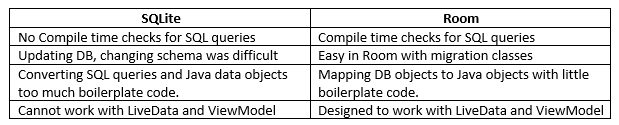
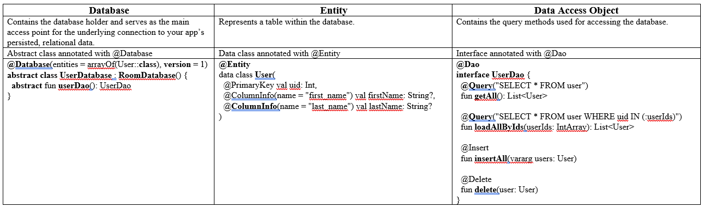
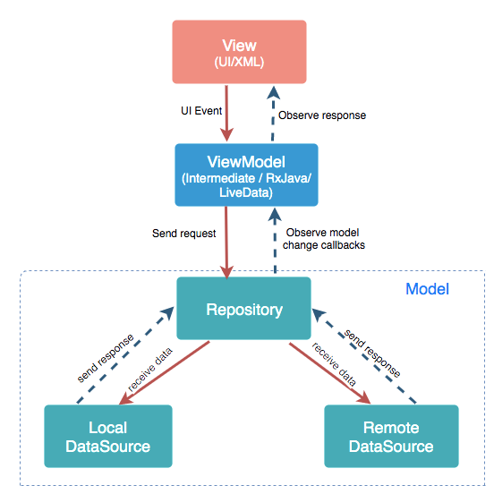

# Inventory_App
A CRUD app for inventories. 

# Screenshots
   

   

   

   

# Learnings

* **SQLite vs Room**
  - 
  
* **Room**
  - ORM (Object Relational Mapping) library which maps the table in a relational database to objects usable in kotlin code. [table -> object]
  - Room provides an abstraction layer over SQLite to allow fluent database access while harnessing the full power of SQLite.
  
* Components of the Room
* 
  
* **Flow**
  - Flow is used for returning a stream of data and can be used with Room to ensure the UI and database are in sync. 
  - To consume the Flow data as a LiveData value, use the asLiveData() function.  
  - Flow can emit multiple values sequentially as opposed to suspend functions that return only as single value. 
  - If the return type of any function is Flow then no need to mark it as suspend function. 
  - Use collect{} function on Flow to specify what to do when we receive an element from Flow. collect{} is a suspend function and therefore needs to be called inside a coroutine.
  - ```
     fun dataStream(): Flow<Data>
     
     uiScope.launch{
        dataStream().collect{
          updateUI(it)
        }
     }
    ```
  
* **MVVM Architecture**
   - MVVM architecture is a Model-View-ViewModel architecture that removes the tight coupling between each component. Most importantly, in this architecture, the children don't have the direct reference to the parent, they only have the reference by observables.
   - 
   - **Model**: It represents the data and the business logic of the app. It consists of the business logic - local and remote data source, model classes, repository.
   - **View**: It consists of the UI Code (Activity, Fragment, XML). It sends the user action to the ViewModel but does not get the response back directly. To get the response, it has to subscribe to the observables which ViewModel exposes to it.
   - **ViewModel**: It is a bridge between the View and Model. ViewModel has no idea which View has to use it as it does not have a direct reference to the View. It interacts with the Model and exposes the observable that can be observed by the View.

* **Test Orchestrator**
  - Test Orchestrator allows you to run tests with Instrumentation. Instrumentation clears the app state between each test, so that no test depends on each other. This is called a *stateless test*, because the state of each test is independent from the other. 
  - When each test runs in its own instrumentation, if one test fails other tests will continue to execute. This is very important for large apps with many tests, and allows the developer to isolate the exact problem. 
  - It's important to clear data between tests that test the database, because if residual data is left over from one test, it could affect the following test.
  
* Kotlin provides an ability to extend a class with new functionality without having to inherit from the class or modify the existing definition of the class. This is done via special declarations called **extensions**.

* The **copy()** function is provided by default to all the instances of data classes. It lets you copy an object and change some of its properties, while keeping the rest of its properties unchanged.

# Questions

* **Difference between abstract classes and interfaces. When to use what?**
