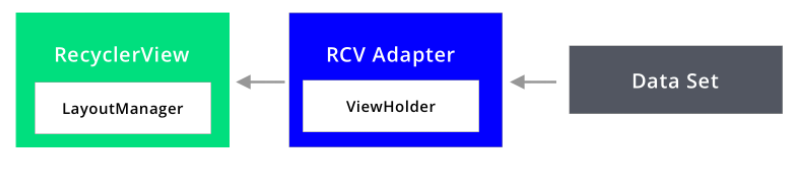

# Affirmations App
A single activity app displaying affirmations in a RecyclerView.

# Screenshot
 

# Learnings

* FrameLayout hold a single child view, because it is difficult to organize child views on different screen sizes without the children overlapping each other.

* RecyclerView is an advanced version of ListView and GridView. 
  - A ViewGroup that populates a list on a collection of data provided with the help of ViewHolder and draws it to the user on-screen.
  - Each individual element in the list is defined by a view holder object.
  
* Advantage of RecyclerView: Reduces findViewById callbacks, Improves performance. 
    
* Three major components of RecyclerView
  - Adapter
  - ViewHolder
  - LayoutManager
    
* **Adapter:** It takes the data set which has to be displayed to the user in RecyclerView. It is like the main responsible class to bind the views to ViewHolder object and display it. [subclass of RecyclerView.Adapter class]. 
  - Adapter has three main functions that needs to be overridden:
    - *onCreateViewHolder* - Returns ViewHolder object
    - *onBindViewHolder* - This method will fetch the specific data for that item’s position and set it to the item view.
    - *getItemCount* - returns the size of the Data Source

* **ViewHolder:** ViewHolder is a type of a helper class that helps us to draw the UI for individual items on the screen. ViewHolder is helpful for caching the specific item's view. [subclass of RecyclerView.ViewHolder class and an inner class to Adapter class]

* **LayoutManager:** LayoutManager in recyclerView helps us to figure out how we need to display the items on the screen. 
  - RecyclerView provides by default a few implementations of layoutManager 
    - Types: LinearLayoutManger, GridLayoutManager, StaggeredGridLayoutManager
  
* [Observation: It is not necessary that for every item view, a new instance of ViewHolder is meant to be created. ViewHolders are generally created for those item views that are initially in visible portion of the screen and for some item views staying in the waiting queue. For the rest of the items, when we scroll up, the cached View holder objects are recycled with new data and displayed on the screen. This, apparently, serves the purpose of RecyclerView. ]
  

    
* Working with RecyclerView
  - You first create a Data source that needs to be displayed in a list.
  - You create two xml layouts: 
     1. One with Recycler view widget
     2. Second with each item view layout
  - You create your custom Adapter class that extends the RecyclerView.Adapter with generic type as its inner View Holder class. Takes in Data source as its constructor parameter.
  - When prompted, override three methods of Adapter class.
  - Then, you create a nested custom ViewHolder class that extends RecyclerView.ViewHolder
  - Populate your View Holder class with findViewByIds of each views per item view. Takes in the item view object as its constructor parameter.
  - onCreateViewHolder will first inflate the item view layout explicitly using LayoutInflater, create a view object and then return a ViewHolder object.
  - onBindViewHolder will bind the data to the views of each item view from the data source.
  - getItemCount return the data source size/length
  - In a corresponding Activity, Inflate the RecyclerView Layout, set adapter as your custom Adapter and layout manager as whatever you desire.
  - Hooray! Your RecyclerView is ready to conquer the world of apps! 
  
* For a list that changes periodically, extend your Adapter class with **ListAdapter** not *RecyclerView.Adapter*.

* Unit tests runs locally on the m/c while Instrumentation test runs on the emulator.
  
# Extensible topics
* Handling item clicks
* Animations for adding, updating and removing items
* Pagination - applicable when your list is endlessly long.
* ListAdapter - applicable when your list changes periodically.

# Questions

* **Let’s say that each item in your RecyclerView list contains four individual data views, and you don't cache these views in a ViewHolder. If eight items fit on screen, approximately how many extra findViewById() calls will be made if you scroll through 30 items? In addition to the eight items that fit on screen, assume that two extra items are needed for smooth scrolling.**

Ans - With only eight items on screen, we would need at least eight item views, but the question says that we need two extras for smooth scrolling, which means 10 items total. 10 items times 4 individual data views per item means 40 calls to findViewById. And we could cache these views in a ViewHolder to fill our RecyclerView and then access them later when we scroll and recycle views. If we didn't use a ViewHolder, we would have to call findViewById 4 times for each of the 30 items we scroll through, that’s 30x4 or 120 calls to findViewById. So the difference between using a ViewHolder and not using one is 120-40 calls to findViewById. 80 extra calls for not using a ViewHolder! Android phones today are so fast, that you probably wouldn't notice this optimization, but it will give you slightly better battery usage, which could be noticeable if you are scrolling through very large lists. So it’s best to use a ViewHolder.  

