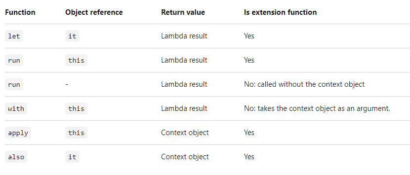
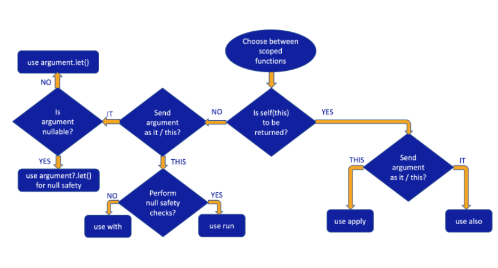

# Cupcake App
A cupcake ordering app that allows the user to create a order for desired no. of cupcakes with different flavours and quantity. Adds extra charge of Rs. 3 if the delivery has to be done on the same day. Price per cupcake is Rs. 2. It displays a summary of the order at the end. We can send the order via another app using implicit intent.

# Screenshots
  

 

 

# Learnings

* *setupActionBarWithNavController(navController)* -> Show a title in the app bar based off of the destination's label, and display the Up button whenever you're not on a top-level destination.

* **viewModels()** gives you the ViewModel instance scoped to the current fragment. This will be different for different fragments.
* **activityViewModels()** gives you the ViewModel instance scoped to the current activity. Therefore the instance will remain the same across multiple fragments in the same activity.

* **Listener binding**
  - ```
    android:onClick="@{() -> viewModel.setFlavor(@string/vanilla)}"
    android:onClick="@{() -> flavorFragment.cancelOrder() }"
    ```
  - Listener bindings are lambda expressions that run when an event happens, such as an onClick event.
  
* **SimpleDateFormat** - [Documentation](https://developer.android.com/reference/java/text/SimpleDateFormat#date-and-time-patterns)
  - A class for formatting and parsing dates in a locale-sensitive manner. It allows for formatting (date → text) and parsing (text → date) dates.
  - You can create an instance of SimpleDateFormat by passing in a pattern string and a locale: `SimpleDateFormat("E MMM d", Locale.getDefault())`
  - A pattern string like "E MMM d" is a representation of Date and Time formats. If the date is January 4 in 2018, the pattern string "EEE, MMM d" parses to "Wed, Jul 4".
  - A Locale object represents a specific geographical, political, or cultural region. Locale.getDefault() to retrieve the locale information set on the user's device and pass it into the SimpleDateFormat constructor.
- ```
   android:checked="@{viewModel.date.equals(viewModel.dateOptions[0])}"
   android:onClick="@{() -> viewModel.setDate(viewModel.dateOptions[0])}"
   android:text="@{viewModel.dateOptions[0]}"
  ```
  
* This will set the lifecycle owner on the binding object. By setting the lifecycle owner, the app will be able to observe LiveData objects.
  - ```
    binding.lifecycleOwner = viewLifecycleOwner
    ```
* The LiveData transformation method(s) provides a way to perform data manipulations on the source LiveData and return a resulting LiveData object.
  
* **LiveData Transformations**
  - The LiveData transformation method(s) provides a way to perform data manipulations on the source LiveData and return a resulting LiveData object. 
  - In simple terms, it transforms the value of LiveData into another value. These transformations aren't calculated unless an observer is observing the LiveData object.
  -  Some real-time examples where you may use a LiveData transformation:
     - Format date, time strings for display
     - Sorting a list of items
     - Filtering or grouping the items 
     - Calculate the result from a list like sum of all the items, number of items, return the last item, and so on.
  - * Transformation Functions
      - **map()** -> Applies a function on the value stored in the LiveData object, and propagates the result downstream. Not suitable for time-consuming operation.
      - **switchMap()** - Similar to map, applies a function to the value stored in the LiveData object and unwraps and dispatches the result downstream. The function passed to switchMap() must return a LiveData object. Used specifically for performing time-consuming operation.

* **Tasks**
  - A task is a collection of activities that the user interacts with when performing a certain job (i.e. checking email, creating a cupcake order, taking a photo).

* **Backstack**
  - Activities are arranged in a stack, known as a back stack, where each new activity the user visits gets pushed onto the back stack for the task. The back stack is useful for when the user wants to navigate backwards. 
  - The Navigation library allows you to pop a fragment destination off the back stack each time the user hits the Back button or Up Button.
  - **popUpTo** -> Specify the app:popUpTo attribute on an action in the navigation graph, in order to pop destinations off the back stack until the specified one in the attribute value.
  - **popUpToInclusive** -> Specify app:popUpToInclusive="true" on an action when the destination specified in app:popUpTo should also be popped off the back stack.
  
* **Quantity Strings**
  - By declaring a plurals resource, you can specify different string resources to use based on what the quantity is, for example in the singular or plural case.
  - ```
    <plurals name="cupcake_qtt">
        <item quantity="one">%d cupcake</item>
        <item quantity="other">%d cupcakes</item>
    </plurals>
    ```
  - When calling getQuantityString(), you need to pass in the quantity twice because the first quantity parameter is used to select the correct plural string. The second quantity parameter is used in the %d placeholder of the actual string resource.
  - ```
    resources.getQuantityString(R.plurals.cupcake_qtt, 6, 6)
    ```
  
* You can create an implicit intent to share content to an email app, using Intent.ACTION_SEND and populating intent extras such as Intent.EXTRA_EMAIL, Intent.EXTRA_SUBJECT, and Intent.EXTRA_TEXT to name a few.
  
* **Scope functions** - let, with, run, apply, also

- 
 
- 

* **MediatorLiveData**
  - MediatorLiveData is a subclass of MutableLiveData therefore MediatorLiveData can access each and every property of MutableLiveData as well as LiveData.
  - Consider the following scenario: we have 2 instances of LiveData, let's name them *liveData1* and *liveData2*, and we want to merge their emissions in one object: *liveDataMerger*. Then, *liveData1* and *liveData2* will become sources for the MediatorLiveData *liveDataMerger* and every time onChanged callback is called for either of them, we set a new value in *liveDataMerger*.
  - ```
    LiveData liveData1 = ...;
    LiveData liveData2 = ...;
    
    MediatorLiveData liveDataMerger = new MediatorLiveData<>();
    liveDataMerger.addSource(liveData1, value -> liveDataMerger.setValue(value));
    liveDataMerger.addSource(liveData2, value -> liveDataMerger.setValue(value));
    ```
  - Let's consider that we only want 10 values emitted by *liveData1*, to be merged in the *liveDataMerger*. Then, after 10 values, we can stop listening to *liveData1* and remove it as a source.
  - ```
    liveDataMerger.addSource(liveData1, new Observer() {
      private int count = 1;

      @Override public void onChanged(@Nullable Integer s) {
          count++;
          liveDataMerger.setValue(s);
          if (count > 10) {
              liveDataMerger.removeSource(liveData1);
          }
      }
    });
    ```
  

# Questions

* **Error during test: java.lang.RuntimeException: Method i in android.util.Log not mocked.**
  - Comment every log statement that the test come across.
  
* **androidx.test.espresso.base.RootViewPicker$RootViewWithoutFocusException: Waited for the root of the view hierarchy to have window focus and not request layout for 10 seconds.**
  - Close dialog on the emulator

* **In one of the dev talks, it was said that "If you need a lifecycle in your viewModel, you totally need a transformation". Didn't understood this part.**
  
* **MediatorLiveData use case?**

* **Navigation actions: popUpTo and popUpToInclusive not working?**
