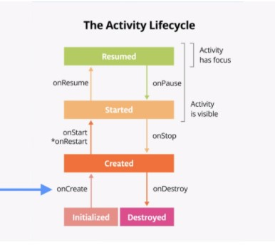
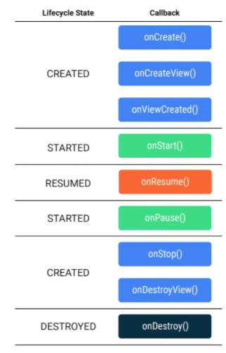

# Dessert Clicker App
App to understand activity lifecycle callbacks.

## Screenshots
  

 

# Learnings

* Activity Lifecycle
* 

* onCreate() and onDestroy() are only called once during the lifetime of a single activity instance: onCreate() to initialize the app for the very first time, a

* onStart() and onStop() are called multiple times as the user navigates to and from the activity.

* onResume() method is called when the activity has focus, and onPause() is called when the activity loses focus.

* onRestart() method is like onCreate(). Either onCreate() or onRestart() is called before the activity becomes visible. The onCreate() method is called only the first time, and onRestart() is called after that. onRestart() method is a place to put code that you only want to call if your activity is not being started for the first time.

* Lifecycle callbacks when activity is rotated [data loss]
  - onCreate-onStart-onResume-onPause-onStop-onDestroy-onCreate-onStart-onResume

* Lifecycle callbacks when app is sent to background using home button and retrieved again in foreground [no data loss]
  - onCreate-onStart-onResume-onPause-onStop-onRestart-onStart-onResume

* Lifecycle callbacks when app is sent to background using back button and retrieved again in foreground [data loss]
  - onCreate-onStart-onResume-onPause-onStop-onDestroy-onCreate-onStart-onResume

* Lifecycle callbacks when app loses focus due to on-screen dialog and later gains focus on closing dialog [no data loss]
  - onCreate-onStart-onResume-onPause-onResume
  
* onSaveInstanceState() method is a callback you use to save any data that you might need if the Activity is destroyed. It gives you a chance to save a small amount of information to a bundle as your activity exits the foreground.

* onSaveInstanceState() is called just before onDestroy() and onRestoreInstanceState() is called just before onStart().

* Fragment Lifecycle
* 

* Also similar to activities, the Fragment class provides many methods that you can override to respond to lifecycle events.
- onCreate(): The fragment has been instantiated and is in the CREATED state. However, its corresponding view has not been created yet.
- onCreateView(): This method is where you inflate the layout. The fragment has entered the CREATED state.
- onViewCreated(): This is called after the view is created. In this method, you would typically bind specific views to properties by calling findViewById().
- onStart(): The fragment has entered the STARTED state.
- onResume(): The fragment has entered the RESUMED state and now has focus (can respond to user input).
- onPause(): The fragment has re-entered the STARTED state. The UI is visible to the user
- onStop(): The fragment has re-entered the CREATED state. The object is instantiated but is no longer presented on screen.
- onDestroyView(): Called right before the fragment enters the DESTROYED state. The view has already been removed from memory, but the fragment object still exists.
- onDestroy(): The fragment enters the DESTROYED state.

* ShareCompat is a part of android support library and can be used to share content.

# Questions

* How to handle data loss when app is exited using back button but still present in mobile's recent app stack?
