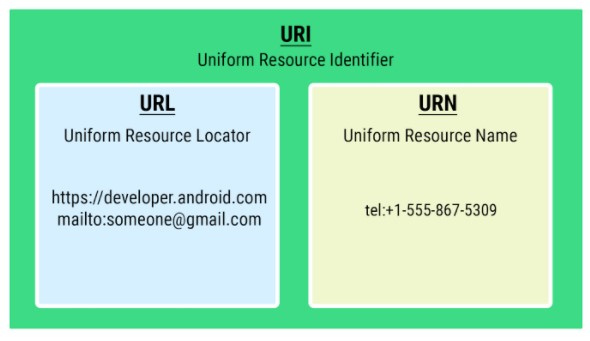

# Words App

Words app allows you to select a letter and use Intents to navigate to an Activity that
presents a number of words starting with that letter. Each word can be looked up via a web search.

Words app contains a scrollable list of 26 letters A to Z in a RecyclerView. The orientation
of the RecyclerView can be changed between a vertical list or a grid of items.

# Screenshots
  

 

# Learnings

* **Fragments** - Fragments are reusable pieces of UI that can be embedded in activities. Fragments make common layout patterns possible, such as master-detail layouts on tablets, or multiple tabs within the same activity.
  
* The app demonstrates the use of two types of Intents:
  - **Explicit Intent** : Use explicit intent when you know exactly which Activity can handle your request. Highly specific, where you know the exact activity to be launched, often a screen in your own app.
  - **Implicit Intent** : Use implicit intent when you don't know which activity of which application/s can handle your request. A bit more abstract, where you tell the system the type of action, such as opening a link, composing an email, or making a phone call, and the system is responsible for figuring out how to fulfill the request.
  
* With Explicit intents, you can pass data from one activity to another using **intentObject.putExtra(KEY,VALUE)** and access the value in other activity using **intent?.extras?.get<Datatype>(KEY)**.

* With Implicit Intents, you can perform a variety of operation using app's installed in user's phone.
  - ACTION_SET_ALARM – setting an alarm in the background 
  - ACTION_DIAL – initiating a phone call
  - ACTION_SEND - To send an email/sms.
  - ACTION_IMAGE_CAPTURE - To open a camera app and receive the resulting photo.
  - ACTION_VIEW - To open web page using web url. Eg. *val intent = Intent(Intent.ACTION_VIEW, URL)*
  
* Your launcher-activity should always be defined in the **<intent-filter>** of the manifest file.
    
* You can create a menu inside AppBar usually referred as OptionsMenu.
  - Create an xml file with root <menu> tag inside the menu folder.
  - You can create multiple menu options but make sure that they don't overlap with other contents of AppBar.
  - Some of the properties of menu item are - id, title, showAsAction, icon
  - showAsAction can have different values:
    - **ifRoom** : Show in AppBar only if there is room for it to be displayed. Otherwise, collapse the item in a dropdown menu.
    - **always** : As name suggest, always show the item inside the AppBar.
    - **never** : As name suggests, never show the the item inside AppBar. Show it in a dropdown menu.
  - Inside onCreate, call **setHasOptionsMenu(true)**
  - Override two methods:
    - **onCreateOptionsMenu** - Inflate the MenuInflater with the menu xml file.
    - **onOptionsItemSelected** - Here, you should retrieve the id of the item and define what should happen when the item is clicked.
  
* Android Jetpack provides the Navigation component to help you handle any navigation implementation, simple or complex, in your app. Three important components of Navigation component are:
  - **Navigation Graph**: An XML file that provides a visual representation of navigation in your app. consists of destinations which correspond to individual activities and fragments as well as actions between them to navigate from one destination to another. 
  - **NavHostFragment**: A container in which the fragments are swapped/replaced. When you navigate between fragments, the destination shown in the NavHostFragment is updated. 
  - **NavController**: This object actually does the navigation. NavController's navigate() method is used to swap the fragment that's displayed. The NavController also helps you to respond to the system "up" button to navigate back to the previously displayed fragment.

* **FragmentContainerView**: Used to embed fragments in other activities and can manage navigation between fragments. Important attributes: name, defaultNavHost, navGraph.
* **NavigationView**: Menu for DrawerLayout. Not to be confused as a part of Navigation component.
* **NavigationUI**: Responsible for updating content outside the NavHostFragment. For eg. Navigation using BottomNavBar, NavigationView, that cannot have direct action arrows for destinations.

* The Navigation Architecture Component is designed for apps that have **one main activity with multiple fragment destinations**. The main activity “hosts” the navigation graph.

* SafeArgs plugin allows you to enter information about the arguments that you wan to pass to the destinations inside navigation graph. Safe Args is strongly recommended for navigating and passing data, because it **ensures type-safety**.

* Arguments are defined for destinations in navGraph not for Actions.
  
* Get started with Navigation:
  - Include these two dependencies and one safeargs plugin inside **app's build.gradle**: 
    - *implementation "androidx.navigation:navigation-fragment-ktx:$nav_version"* 
    - *implementation "androidx.navigation:navigation-ui-ktx:$nav_version"* 
    - *id 'androidx.navigation.safeargs.kotlin'* 
  - Include safeargs classpath inside **project's build.gradle**:
    - *classpath "androidx.navigation:navigation-safe-args-gradle-plugin:$nav_version"*
  - Create a navGraph.xml and fill it up with all destinations and actions between them. Don't forget to mark a fragment as start destination.  
  - Set arguments type and name for the destinations if required. Set label if desired.  
  - Embed the NavHostFragment in FragmentContainerView by setting attributes: name, defaultNavHost, navGraph
  - Get a reference of the NavHostFragment inside MainActivity and assign it to NavController.
  - setupActionBarWithNavController to ensure the menu items are visible on every fragment.
  - Override onSupportNavigateUp() to extend support for up button navigation.
  - To navigate from one destination to another:
    -**val action = FragmentDirections.actionThisFragmentToThatFragment(arg_name = argument_value)**
    -**findNavController().navigate(action)**
  - use arguments keyword or navArgs to retrieve argument value inside other fragment.  
  
* In Kotlin, any property name preceded by an underscore means that the property isn't intended to be accessed directly outside of the class/scope.

* There are two very important terms used in testing:
  - **False positive** - When a test yields a passing result even though something is wrong and the test should fail.
  - **False negative** - When a test yields a failing result when things are correct and the test should pass.
  
* Avoid Repetitive test code with annotations:
  - **@Before** run before every function.
  - **@After** run after every function. 
  - **@BeforeClass** runs once before anything in the class runs.
  - **@AfterClass** runs once after everything else in the class has run.

# Extensible Topics
* Deep links - implicit and explicit deep links
* Transition Animations

# Questions

* **onCreateView() vs onViewCreated()?**
  - onCreateView is very specifically just about inflating and returning a view (via binding or just a layout inflater), nothing more. Then onViewCreated is where you do follow-on initialization (e.g. setting an adapter, observing ViewModel LiveData, etc).

* **What exactly is a Bundle?**
  - Think of it as a key-value pair used to pass data between classes, such as activities and fragments.
  
* **double-bang(!!) vs elvis (?:) vs safe-call(?.)?**
  - double-bang(!!) - If a value is not null, return it otherwise throw NPE.[eg. val name = object!!.name ]
  - safe-call(?.) - If a value is not null, return it otherwise return null. [eg. val name = object?.name]
  - elvis-operator(?:) - If value one is not null, return it otherwise return value two on the other side of elvis operator. [eg. val name = object.name ?: "Default name"]
  
* Lambdas vs Higher-Order Functions vs Callback Functions?
  - A lambda is a *function without a name* that can be passed as an expression immediately. [e.g. { a: Int -> a * 3 }]
  - A higher-order function means *passing a function to another function*, or *returning a function from another function*.

* **URI vs URL vs URN?**
* 
  - URI stands (Uniform Resource Identifier) is a string of characters used to identify a name or a resource on the Internet. 
  - URL (Uniform Resource Locator) contains information about how to fetch a resource from its location. It always starts with a protocol name. 
  - URN (Uniform Resource Name) identifies a resource by name. It always starts with the prefix urn: or tel:.
  - All URLs and URNs are URIs, but not all URIs are URLs or URNs. URL, URN are subsets of URI.
  - Examples:
    - URL: ftp://ftp.is.co.za/rfc/rfc1808.txt
    - URL: http://www.ietf.org/rfc/rfc2396.txt
    - URL: ldap://[2001:db8::7]/c=GB?objectClass?one
    - URL: mailto:John.Doe@example.com
    - URL: telnet://192.0.2.16:80/
    - URN: urn:oasis:names:specification:docbook:dtd:xml:4.1.2
    - URN: tel:+1-816-555-1212
    - URN: urn:isbn:0451450523 
  
* **How to persist the state of layout manager selected by user even when app is exited?**
  
* **How to handle app crash during implicit intent when no proper apps are available on user device to support the intent action? Similar to *if (intent.resolveActivity(packageManager) != null) { startActivity(intent)}*  but for fragments?**

* **Both Intent.ACTION_SEND and ShareCompat.IntentBuilder have the same same functionality. Which one to prefer over other and under what scenario?**

* **requireContext() vs context vs applicationContext vs this?**

